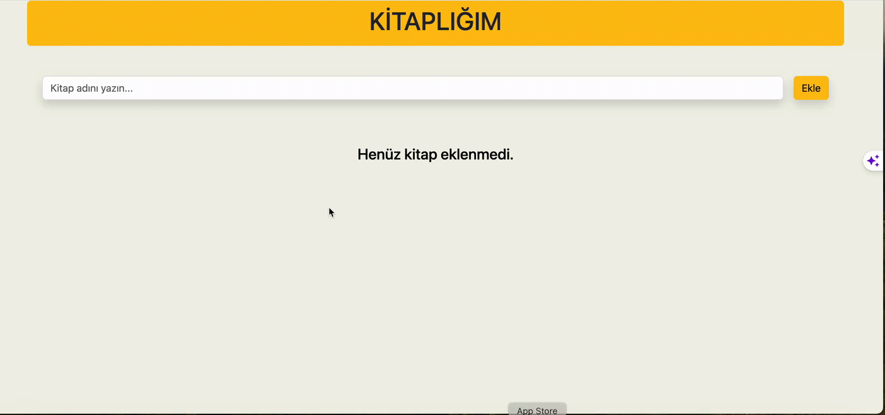

## CRUD APP PROJESİ 

Create Read Update Delete
Oluştur Oku Düzenle Sil

## PROJE HAKKINDA 
Bu program, kullanıcıların okudukları veya okumayı planladıkları kitapları yönetmelerine yardımcı olmak için tasarlanmış basit bir kitap listesi uygulamasıdır. Kullanıcılar, program aracılığıyla kitap ekleyebilir, düzenleyebilir, işaretleyebilir ve silebilirler.

## Özellikler

- Yeni Kitap Ekleme: Kullanıcılar kitap adını girdikten sonra yeni bir kitap ekleyebilirler.
- Okundu / Okunmadı İşaretleme: Kullanıcılar ekledikleri kitapları okundu veya okunmadı olarak işaretleyebilirler.
- Düzenleme: Kullanıcılar mevcut kitapların adını düzenleyebilirler.
- Silme: Kullanıcılar artık listelerinde görmek istemedikleri kitapları silebilirler.

## KULLANILAN TEKNOLOJİLER

- CSS
- BOOTSTRAP
- JAVASCRİPT
- REACT
  
## KULLANILAN KÜTÜPHANELER

- React-toastify
- UUİD

### `Screen`

